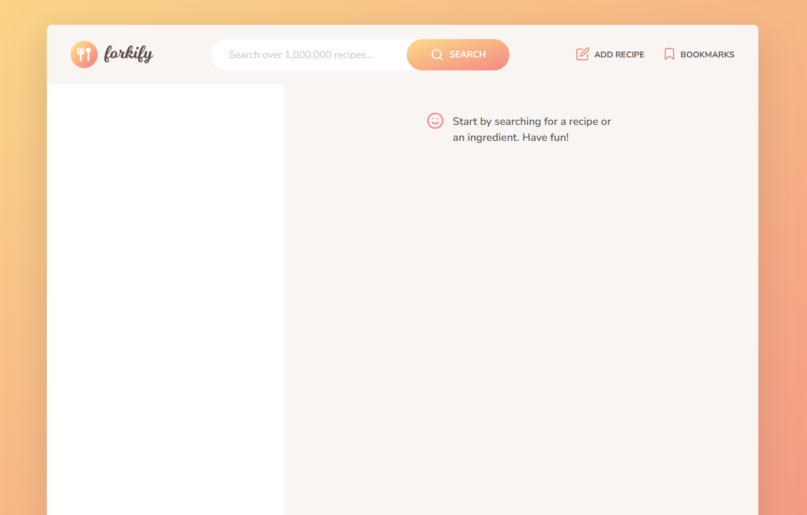
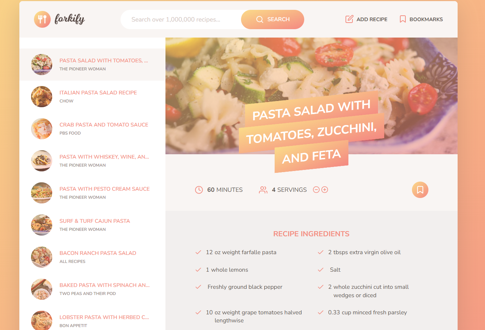
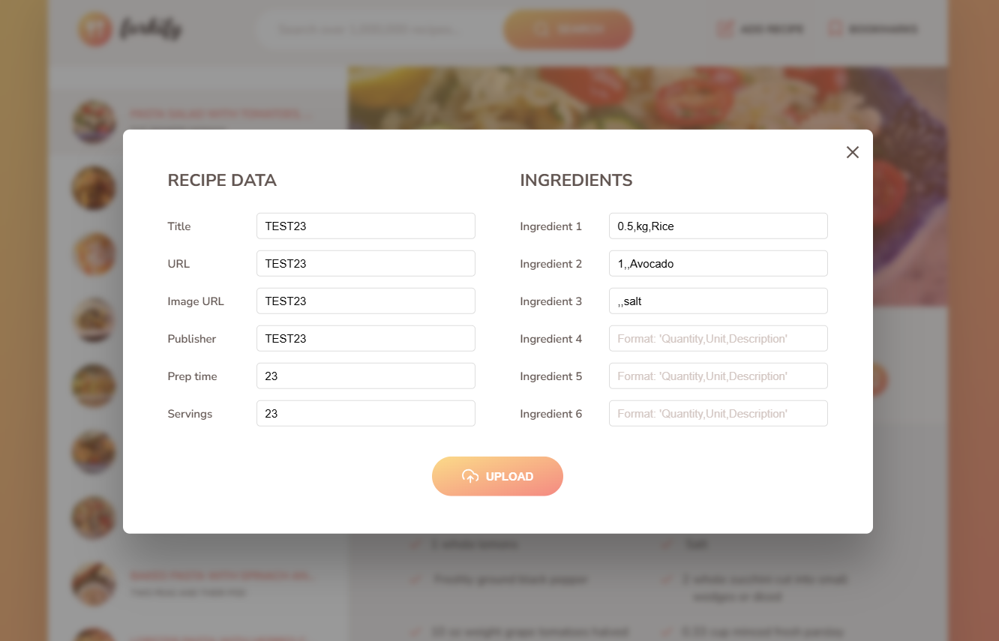
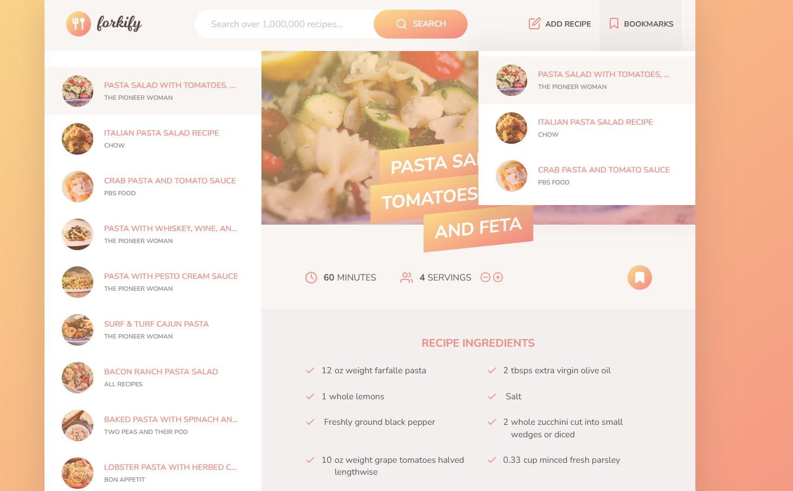

# Forkify Project

A modern recipe application built with JavaScript, Parcel, and SCSS. Forkify allows users to search for recipes, view detailed cooking instructions, bookmark favorites, and upload their own custom recipes—all in a fast, responsive, and user-friendly interface.

## Features

- **Search Recipes:** Find recipes from a public API by keyword with real-time search suggestions
- **Recipe Details:** View ingredients, cooking time, servings, and directions
- **Adjust Servings:** Dynamically update ingredient quantities based on desired servings
- **Bookmark Recipes:** Save favorite recipes to revisit later with persistent storage
- **Upload Recipes:** Add your own recipes to the app with validation
- **Pagination:** Browse search results with easy navigation
- **Responsive Design:** Optimized for desktop and mobile devices
- **Error Handling:** User-friendly error messages and loading spinners
- **Performance Optimized:** Caching, debouncing, and retry logic for better UX
- **PWA Ready:** Progressive Web App features with offline support
- **Keyboard Navigation:** Full keyboard support for accessibility

## Technologies Used

- **JavaScript (ES6+)**
- **Parcel (v2) Bundler**
- **SCSS for styling**
- **HTML5**
- **Forkify API**
- **Service Workers** for offline functionality
- **Local Storage** for data persistence

## Getting Started

1. **Clone the repository:**

   ```bash
   git clone <your-fork-or-repo-url>
   cd Forkify-App
   ```

2. **Install dependencies:**

   ```bash
   npm install
   ```

3. **Set up environment variables (optional):**

   ```bash
   # Create a .env file in the root directory
   FORKIFY_API_KEY=your_api_key_here
   ```

4. **Run the development server:**

   ```bash
   # For Windows (if not on C: drive)
   $env:TEMP="D:\Portfolio Projects\Course Projects\JavaScript Projects\Forkify-App\.parcel-cache"
   $env:TMP="D:\Portfolio Projects\Course Projects\JavaScript Projects\Forkify-App\.parcel-cache"
   npm run dev
   ```

5. **Open the app:**
   Visit [http://localhost:1234](http://localhost:1234) in your browser.

## Available Scripts

- `npm start` - Start development server
- `npm run dev` - Start development server and open browser
- `npm run build` - Build for production
- `npm run clean` - Clean build artifacts
- `npm run lint` - Run ESLint for code quality
- `npm run format` - Format code with Prettier

## Recent Improvements

### Performance Enhancements

- **API Caching:** Implemented intelligent caching for API responses
- **Search Debouncing:** Real-time search with 500ms debounce delay
- **Retry Logic:** Automatic retry with exponential backoff for failed requests
- **Optimized DOM Updates:** Efficient DOM manipulation without full re-renders

### User Experience

- **Better Error Messages:** Contextual error messages for different failure scenarios
- **Loading States:** Improved loading indicators throughout the app
- **Keyboard Navigation:** Full keyboard support (Escape to close modals, Enter to search)
- **Accessibility:** Better ARIA support and keyboard navigation

### Code Quality

- **ESLint Configuration:** Code quality enforcement
- **Prettier Integration:** Consistent code formatting
- **Modern SCSS:** Updated to use `@use` instead of deprecated `@import`
- **Environment Variables:** Secure API key management

### Progressive Web App Features

- **Service Worker:** Offline functionality and caching
- **Web App Manifest:** Installable app experience
- **PWA Meta Tags:** Better mobile experience

## What I Learned

- **Modern JavaScript:** Deepened my understanding of ES6+ features, async/await, and modular code organization
- **MVC Architecture:** Practiced separating concerns using Model-View-Controller principles for scalable, maintainable code
- **Parcel Bundler:** Learned how to bundle assets, manage static files, and troubleshoot cross-drive build issues on Windows
- **API Integration:** Gained experience fetching and handling data from third-party APIs with caching and retry logic
- **Error Handling:** Implemented robust error and loading state management for a better user experience
- **SCSS & Responsive Design:** Improved skills in writing modular, maintainable SCSS and building responsive layouts
- **Performance Optimization:** Learned caching strategies, debouncing, and efficient DOM manipulation
- **PWA Development:** Implemented service workers and web app manifests for offline functionality
- **Code Quality Tools:** Integrated ESLint and Prettier for consistent code quality

## Screenshots






## Future Enhancements

- [ ] Add TypeScript for better type safety
- [ ] Implement unit and integration tests
- [ ] Add recipe sharing functionality
- [ ] Implement user accounts and cloud sync
- [ ] Add recipe categories and filtering
- [ ] Implement recipe recommendations
- [ ] Add nutrition information
- [ ] Implement recipe scaling for different serving sizes

## Credits

- [Forkify API by Jonas Schmedtmann](https://forkify-api.herokuapp.com/)
- Original project inspired by Jonas Schmedtmann's "The Complete JavaScript Course".
